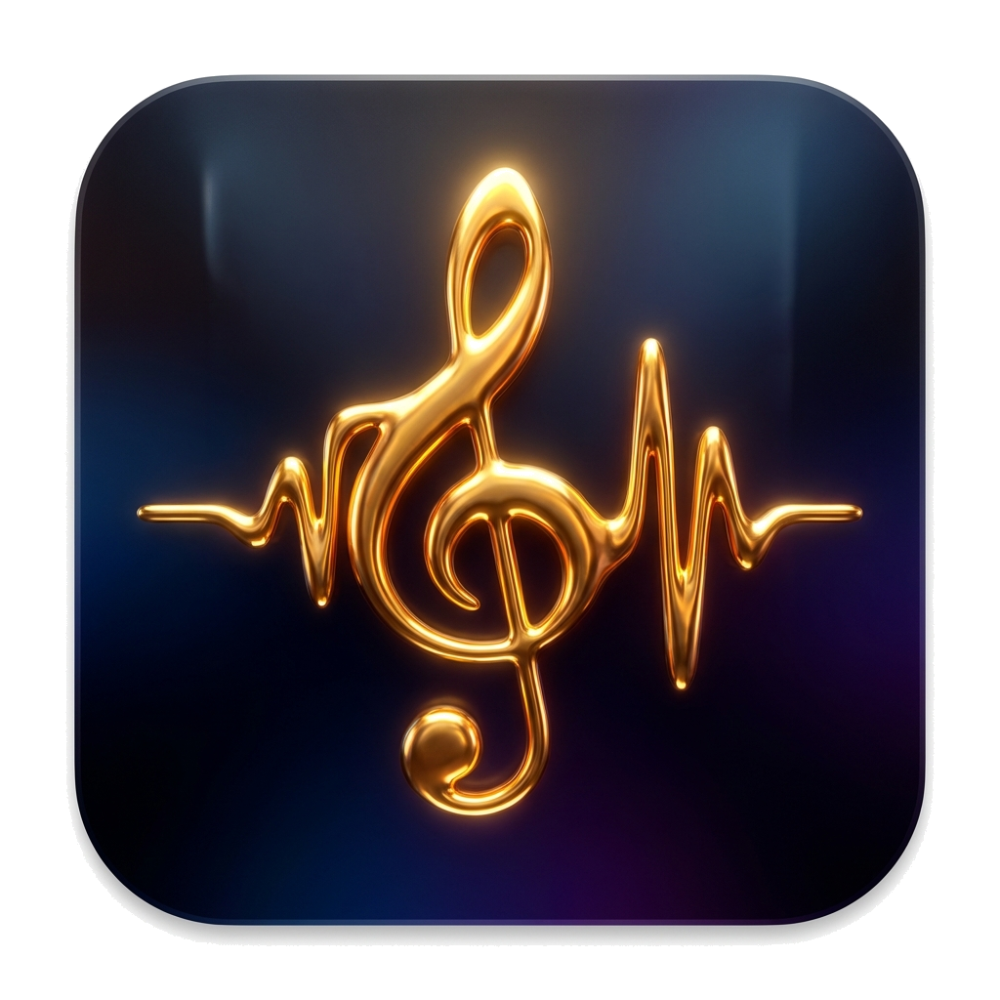

# Molten Music 🎵

Molten Music is a modern, cross-platform desktop music and podcast player built with Electron, React, and Go. It features a futuristic "liquid metal" design, powerful desktop lyric capabilities, RSS podcast integration, and offline AI-powered transcription.



## ✨ Features

- **Futuristic UI**: Glassmorphism design with fluid animations and a "molten" aesthetic.
- **Desktop Lyrics**: 
  - Floating desktop lyric window with transparent mode.
  - Karaoke-style word-by-word highlighting (supports .lrc and .srt).
  - "Lock" mode (click-through) to work without interruption.
- **RSS Podcast System**: 
  - Subscribe to your favorite tech and news podcasts (RSSHub supported).
  - Built-in podcasts: The Daily, Techmeme Ride Home, GCORES, All Ears English, and more.
  - One-click download and offline cache management.
- **AI-Powered Transcription**:
  - Integrated with OpenAI Whisper.
  - One-click "AI Generate Lyrics" for songs or podcasts without lyric files.
  - **Option 3 Optimization**: Transcriptions are stored directly in the database, saving disk space and simplifying deployment.
- **Smart Audio Engine**:
  - **Audio Output Selection**: Switch between speakers, headphones, or Bluetooth devices directly in the app.
  - **Loop Playback**: High-visibility toggle for repeating your favorite tracks or episodes.
  - **Lyric Sync Tool**: Quick +/- 0.5s offset adjustment buttons.

## 🛠️ Tech Stack

- **Frontend**: [Electron](https://www.electronjs.org/), [React 19](https://react.dev/), [TypeScript](https://www.typescriptlang.org/)
- **Backend**: [Go](https://go.dev/) (SQLite + GORM)
- **State Management**: [Zustand](https://github.com/pmndrs/zustand)
- **Build Tool**: [Vite](https://vitejs.dev/)
- **CI/CD**: GitHub Actions (Docker Build & Multi-platform Release)

## 🚀 Getting Started

### Prerequisites
- Node.js (v20+)
- Go (v1.23+)
- Docker (for deployment)

### 1. Local Development

#### Start Backend
```bash
cd backend
go run main.go
```
The backend will start on `http://localhost:8080`.

#### Start Frontend
```bash
# In the root directory
pnpm install
pnpm dev
```

### 2. Deployment

#### Backend (Docker)
We use **GHCR (GitHub Container Registry)** for hosting backend images.

**Pull & Run:**
```bash
docker pull ghcr.io/rj9676564/molten-music-backend:latest
docker run -d -p 8080:8080 -v ./molten-data:/app/data ghcr.io/rj9676564/molten-music-backend:latest
```

**Build via GitHub Actions:**
- Push a tag starting with `b*` (e.g., `b1.0.0`) to trigger a backend Docker build.

#### Frontend (Electron)
**Build locally:**
```bash
pnpm build         # Common build
pnpm build:mac-local # Build optimized DMG for Apple Silicon
```

**Auto Release:**
- Push a tag starting with `v*` (e.g., `v1.0.0`) to trigger multi-platform production builds and GitHub Releases.

## 🤖 AI Logic
To use the AI transcription feature, a Whisper ASR Webservice is required.
By default, the backend connects to: `http://xxx/`
You can modify this in `backend/main.go`.

## 📄 License
[MIT](LICENSE)
